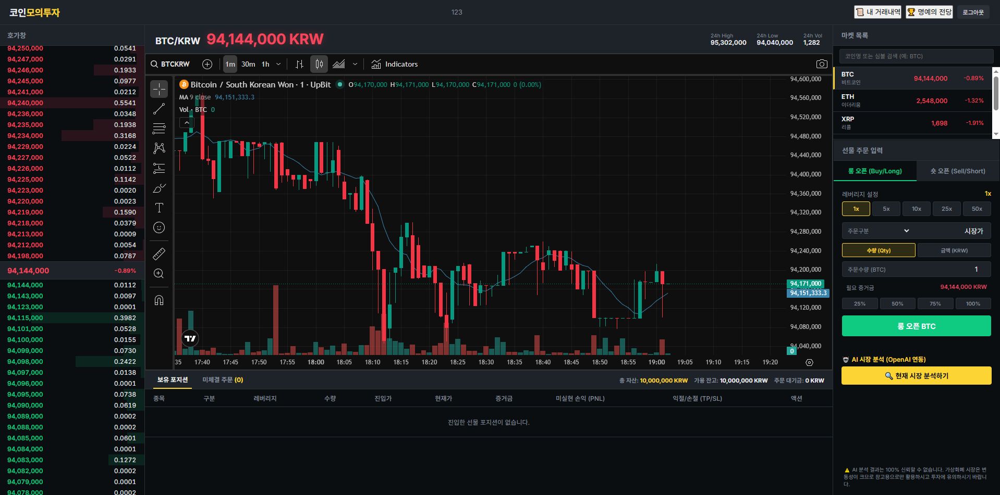

# stock
6/18 5:54 

6/19 19:02

1. 차트뷰 심화
2. 종목 선택 가능
3. 거래 기능의 고도화 (지정가, 예약주문 등)

추후 계획
자본금 인출 및 입금 기능
추가 거래 기능(분할매수, 분할매도 등)

ai 활용 방안 (챗봇? 매수,매도 도우미?)

랭킹 시스템 고도화 (주간 리그전, 브론즈/실버/골드 등급별 리그 운영)

6/19
open ai api키 .env 적용 작업 필요