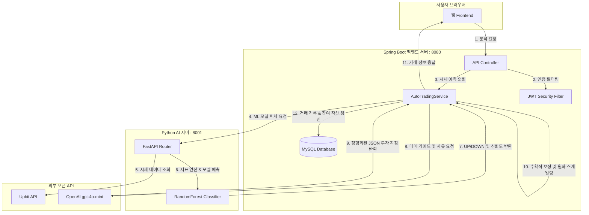

# 📈 AI 기반 실시간 가상화폐 선물 모의투자 플랫폼 (Mock Crypto Futures Trading Platform)


> **"초단타 선물 거래 학습자를 위한 머신러닝 분석 및 OpenAI 연동 모의투자 시스템"**  
> 본 프로젝트는 실시간 가상화폐 시세 데이터를 바탕으로, 머신러닝 단기 트렌드 분석과 OpenAI 기반의 전문 트레이딩 인공지능 지침을 제공하여 유저가 안전하게 가상 선물 포지션(롱/숏) 및 레버리지 거래를 연습할 수 있도록 돕는 실시간 모의투자 플랫폼입니다.

---

## 🛠 1. 기술 스택 (Tech Stack)

### Backend (스프링 백엔드)
- **Java 21** / **Spring Boot 3.3.0**
- **Spring Data JPA** / **Hibernate 6.5**
- **Spring Security** (JWT 기반 Stateless 인증/인가)
- **MySQL 8.0** (도커 기반 컨테이너 구성)
- **Gradle**

### Python AI (예측 서버)
- **Python 3.10**
- **FastAPI** (초고속 비동기 API 서버)
- **Scikit-learn** (RandomForest 기반 머신러닝 모델 구축)
- **Pandas / NumPy** (기술적 보조지표 연산 파이프라인)

### Frontend (사용자 화면)
- **HTML5 / Vanilla CSS**
- **JavaScript** (실시간 차트 및 상태 관리)

---

## 🏗 2. 시스템 아키텍처 (System Architecture)



---

## 🌟 3. 핵심 기능 (Key Features)

### 1) 실시간 가상화폐 시세 연동 및 차트화
- 업비트(Upbit) OpenAPI 연동을 통하여 비트코인(BTC/USDT)을 포함한 주요 5종 가상자산의 최신 분봉 시세 데이터를 주기적으로 갱신하고 대시보드 차트에 시각화합니다.

### 2) 머신러닝 단기 가격 트렌드 예측 (FastAPI)
- 과거 500개의 봉 데이터를 실시간 파싱하여 단/중/장기 이동평균선(SMA), RSI, MACD, 볼린저 밴드 등의 피처를 가공합니다.
- Scikit-learn의 `RandomForestClassifier` 모델을 실시간 학습시켜 다음 1시간 내의 상승(UP) / 하락(DOWN) 트렌드를 분류하고, 추가 지표 가중치 보정을 통하여 신뢰도를 산출합니다.

### 3) OpenAI GPT-4o-mini 연동 투자 가이드라인
- 머신러닝 예측 방향과 확률 데이터를 결합하여 **초단타 선물 거래(스캘핑)**에 부합하는 타이트한 목표가(Take Profit) 및 손절가(Stop Loss) 범위를 도출합니다.
- 변동성에 적합한 선물 레버리지 배율(1배 ~ 50배)과 전문적인 한글 분석 사유를 생성하여 실시간 투자 길잡이를 제공합니다.

### 4) 강력한 백엔드 보안 및 환경 변수 격리
- 외부에 노출되면 치명적인 OpenAI API Key 등의 자격 증명을 `.env` 파일로 완전히 격리하고, `.gitignore`로 관리하여 소스 유출을 차단합니다.
- Spring Boot 2.4+ 버전의 `spring.config.import` 기법을 적용하여 별도의 플러그인 없이 운영체제 종속적인 프로퍼티를 유연하게 동적 로딩합니다.

---

## ⚡ 4. 백엔드 성능 최적화 및 트래픽 부하 테스트 (성능 튜닝 학습 과정)

> **"단순히 기능을 완성하는 것을 넘어, 백엔드의 한계를 측정하고 극복하는 튜닝을 지향합니다."**

본 프로젝트는 대용량 트래픽 상황에서의 병목 현상을 진단하고 인메모리 데이터베이스 캐시를 도입했을 때의 성능 향상을 수치로 검증하기 위해 아래의 부하 테스트 환경을 구축하고 실습하고 있습니다.

### 1) Locust를 활용한 트래픽 부하 테스트 설계
- **스크립트 경로:** [locustfile.py](scratch/locustfile.py)
- **부하 시나리오:**
  1. 가상 유저가 고유 UUID 기반의 무작위 계정으로 동적 회원가입 요청 `/api/auth/signup`
  2. 가입한 계정으로 로그인 요청 `/api/auth/login`을 수행하여 JWT 액세스 토큰 발급
  3. 발급받은 토큰을 HTTP 헤더 `Authorization: Bearer`에 주입
  4. 가상 유저들이 다중 스레드로 `/api/stocks` (시세 조회) 및 `/api/ranking` (수익률 랭킹 조회) API를 끊임없이 요청하여 동시 접속 트래픽을 유발

### 2) 성능 개선 실험 및 비교 연구 (MySQL vs Redis 캐시 도입 로드맵)
- **현재 상황 (MySQL 단독):**
  - 대량의 시세 조회 및 랭킹 정렬 요청이 디스크 기반의 데이터베이스에 직접 집중되어, 동시 접속자 수 증가 시 데이터베이스 커넥션 고갈 및 응답 시간의 급격한 지연(TPS 하락)이 예상됩니다.
- **향후 해결 방안 (Redis 캐시 및 Sorted Set):**
  - 3초 만료 만기의 Redis 인메모리 캐시를 적용하여 데이터베이스 직접 조회를 원천 차단합니다.
  - 리더보드 연산 부하를 해소하기 위해 Redis의 Sorted Set(ZSET) 자료구조를 도입합니다.
  - **검증 계획:** 레디스 도입 전과 후의 Locust 테스트 TPS 및 응답 지연 시간의 수치적 비교 그래프를 포트폴리오에 추가 수록할 예정입니다.

---

## 🚀 5. 실행 방법 (How to Run)

### 1) Prerequisites (사전 준비)
- Java 21 SDK
- Docker & Docker Compose
- Python 3.10+

### 2) 환경 변수 파일 생성
프로젝트 루트 경로에 `.env` 파일을 생성하고 다음과 같이 작성합니다.
```properties
# .env
OPENAI_API_KEY=YOUR_OPENAI_API_KEY_HERE
```

### 3) 백엔드 서버 구동
```bash
# 데이터베이스 컨테이너 구동
docker-compose up -d

# Spring Boot 서버 구동 (Gradle)
./gradlew bootRun
```

### 4) Python AI 예측 서버 구동
```bash
cd python-ai
pip install -r requirements.txt
uvicorn main:app --host 0.0.0.0 --port 8001 --reload
```